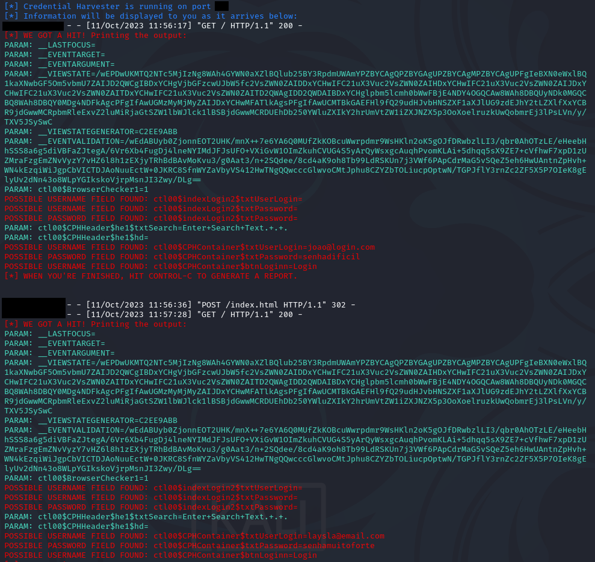

Projeto criado com intuito de criar um <strong><i>phishing</i></strong>, utilizando a ferramenta <i>setoolkit</i>, disponível no sistema operacional <i>Kali Linux</i>.

Diferentemente do projeto proposto pela DIO, foi utilizado outro site como clone para gerar o <i>phishing</i>, visto que o site do <i>Facebook</i> apenas utiliza o protocolo https no momento.

Segue uma amostra dos resultados da atividade (Alguns dados foram omitidos por questão de segurança):
